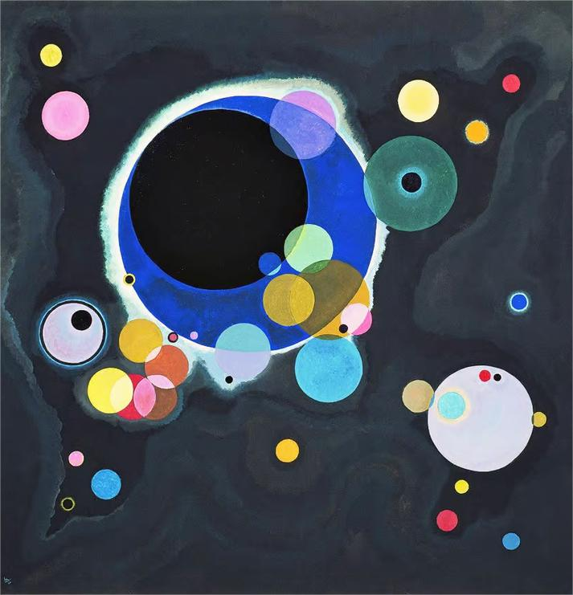
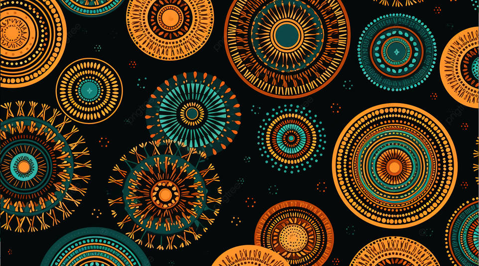
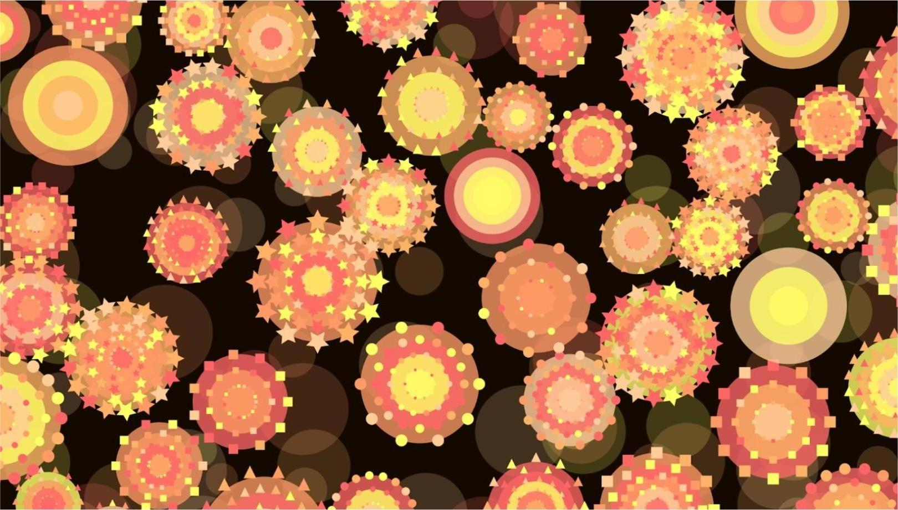
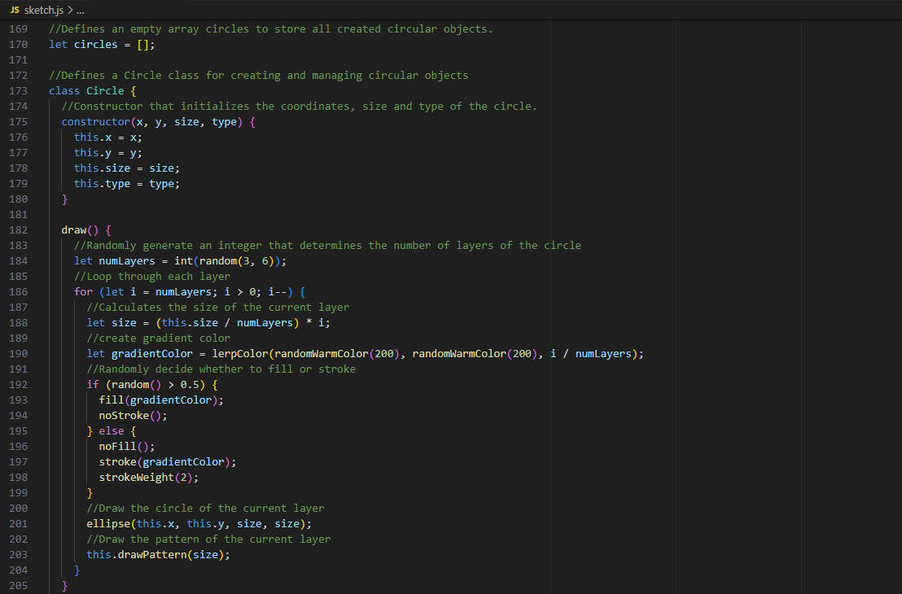
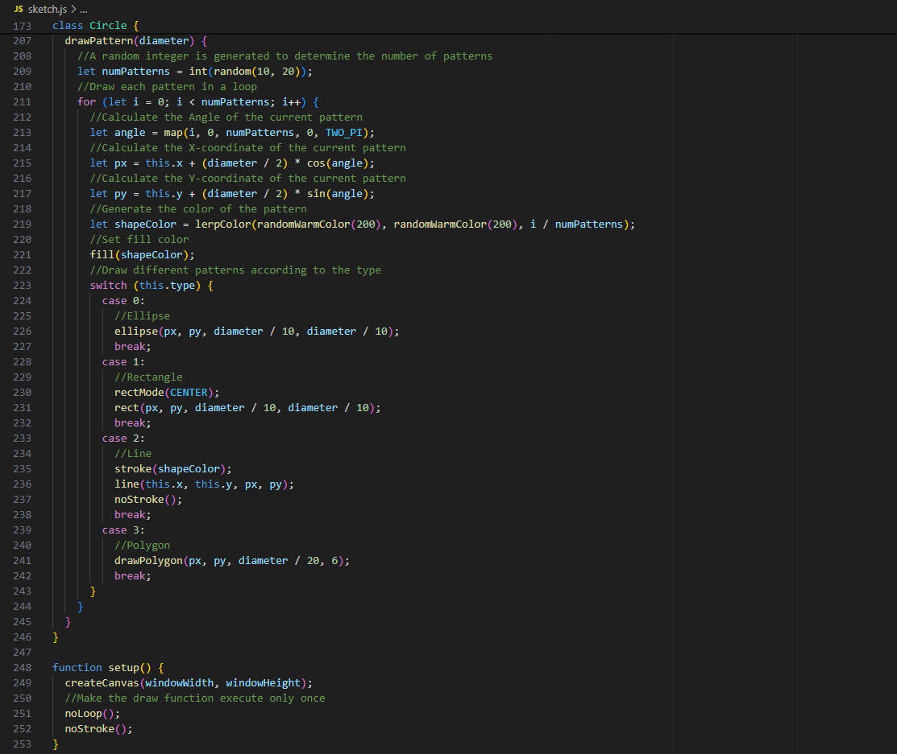
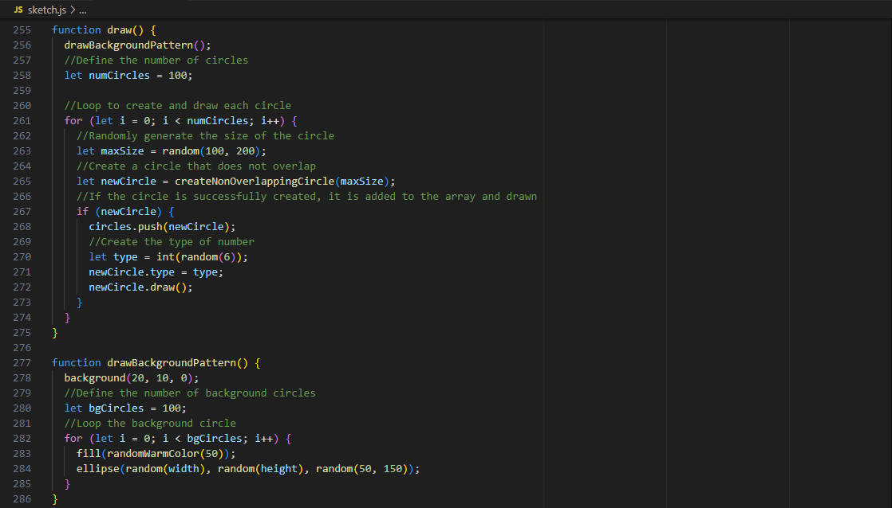
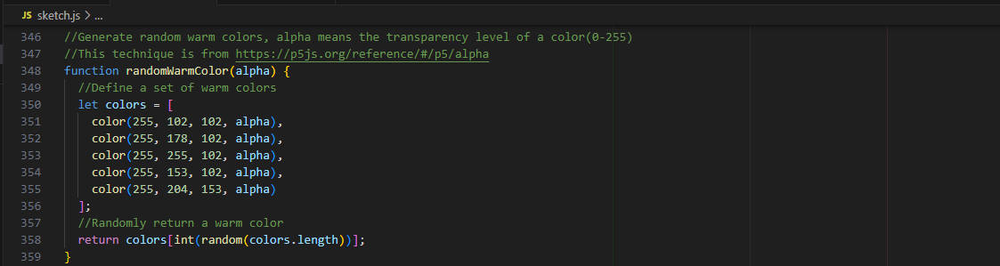

# 9103_Tut-04_GroupA

## Section 1 – Research and inspiration:
When we first saw this artwork, we were drawn in by the vibrant colors and dynamic composition. 

*(Abad, 2000)*

When we began exploring it, we embarked on a journey filled with curiosity and wonder. My approach to understanding and representing this artwork was inspired by sources that shed light on Abad’s life, her artistic vision, and the themes she explored.
We learnt about Abad's background and the stories behind her art helped us grasp the essence of **"Wheels of Fortune"**. Pacita Barsana Abad (October 5, 1946 – December 7, 2004) was an Ivatan and Filipino-American artist and is well-known for her special paintings that were inspired by quilting, where she filled and decorated the canvas with items like buttons, beads, and shells *(Abad, 2000)*. Her vibrant use of colors and dynamic compositions intrigued us, and we found ourselves drawn to the energy and emotion she infused into her work. Understanding the artist's perspective allowed me to appreciate the deeper layers of meaning within the painting. 
This artwork inspired us to decorate our work by using different shapes and using vibrant color to convey a positive attitude.

Additionally, we were also inspried by In Vassily Kandinsky's artwork "Several Circles," where you can see many colorful circles overlapping and intersecting each other.

*(Kandinsky, 1926)*

The circles vary in size and color, creating a sense of movement and rhythm across the canvas. Some circles are bold and vibrant, while others are more subdued. The way the circles interact with each other gives the painting a dynamic and lively feel. It's like looking into a world of swirling colors and shapes, where each circle has its own unique energy and presence.

At the same time, we also find some artworks to be our precedents.

*(Quilt Fabric, Largest Selection of Quilting Fabrics- Free Quilt Patterns- EQuilter.com!, n.d.)*

*(tree, n.d.)*

*(art-pik, n.d.)*

*(user23538080, n.d.)*

### Reference:
Abad, P. (n.d.). Pacita Abad. Pacita Abad. https://pacitaabad.com/

Abad, P. (2000). Wheels of Fortune. https://www.artsy.net/artwork/pacita-abad-wheels-of-fortune

art-pik. (n.d.). Premium Photo | Abstract dot pattern stock illustration. Freepik. https://www.freepik.com/premium-ai-image/abstract-dot-pattern-stock-illustration_151453252.htm

Kandinsky, V. (1926). Several Circles. https://commons.wikimedia.org/wiki/File:Vassily_Kandinsky,_1926_-_Several_Circles,_Gugg_0910_25.jpg

Quilt fabric, Largest selection of quilting fabrics- Free Quilt Patterns- eQuilter.com! (n.d.). Www.equilter.com. https://www.equilter.com/

tree. (n.d.). Pngtree|Vector Repeating Design Circle Ornament Ethnic Seamless Pattern For Fabric Or Textile Texture Background. Pngtree.com. https://pngtree.com/freebackground/vector-repeating-design-circle-ornament-ethnic-seamless-pattern-for-fabric-or-textile-texture_15304866.html

user23538080. (n.d.). Premium Photo | Many Colored Circles and Colorful Dots in the Style of Intricate Psychedelic Art. Freepik. https://www.freepik.com/premium-ai-image/many-colored-circles-colorful-dots-style-intricate-psychedelic-art_97861314.htm

## Section 2 – Technical planning
Since our inspiration is circle, circle is taken as the main class. On this basis, we may decorate circle to become different types of circle. For example, draw different patterns (e.g. circles, rectangles, lines) in each circle and change their color, position, size, etc.

We consider using a window frame or a 500*500 grid to put the pattern in it.

We will be using several functions to draw different shapes and patterns together. Here are the main functions we plan to use:

- We will use drawBackground() to draw the background. We considered using a solid color background to highlight different types of circles; Or create class that add small embellishments to the background, or use transparency to distinguish the subject from the background.

- We planned to preserve the non-overlapping nature of the main circle because we wanted to preserve this one feature of the Wheels of fortune's work. Use createNonOverlapping() to generate non-overlapping circles, call the Circle class method to detect overlapping and randomize the location on the canvas to ensure that the new circle does not overlap with the existing circles.

- Use the drawDecoratedCircle(x, y, size) function to draw decorative circles, and call the Pattern class to draw different types of patterns.  And according to the set number of layers and pattern types, add decorative patterns inside the circle.

- We will also try drawDecoratedRectangle(x, y, width, height) and drawDecoratedLine(x1, y1, x2,y2) for drawing rectangle and line patterns. (or other patterns that will be tried further in iterations)

## Section 3 – Implementation
### Pre-design divergent thinking stage
Based on our choice of Pacita Aba's Wheel of Fortune, other sources of inspiration and general technical planning, we shared our design ideas with our group members through Photoshop, hand-drawing and basic p5js code. Below:

- Naimeng used PS techniques to change the colour scheme based on @user23538080 to change the colour scheme based on her design, and she wanted to present a similar vibrant palette in our group work.

- Yihan created the design idea using hand-drawing. She wanted to use a circle as the basis of the design and surround it with small elements (e.g. hollow circles, rectangles, lines, etc.). She also wrote a simple code to achieve this effect based on this hand-drawn design.

- Zhuoran used p5js to simulate her desired effect; she wanted each circle to present a different design. For example, the surrounding elements are circles, rectangles, or triangles.

- Zhihao created an ‘infinite circle’ effect through hand-drawing, a concept he wanted to incorporate into the final work. He believes that the circle is closely related to π (pi), which is an infinite, non-recurring decimal number and symbolizes the theme of the ‘wheels of fortune’.

### Iteration process
During the pre-design brainstorming phase, each group member had a different idea. After a group meeting, we agreed to use Zhuoran's code as the basis for our design and then incorporate everyone's design ideas as much as possible.

**Iteration 1:** Too much overlap between patterns will make the project too confusing. So, in iteration 1, there will be no overlap between patterns. At the same time, we increase the number of circles so that fill the canvas space of the project as much as possible. At this stage, we will keep the plan from section 1.

**Iteration 2:** We added more elements, such as the star, which we thought would make the overall picture look richer. We also felt that the colours in iteration 1 needed to be less, so we all agreed that we could unify the colours in iteration 2 into a warm color.

**Iteration 3:** However, we could not distinguish the uniqueness of each circle with a uniform warm colour palette. Therefore, we decided to set the fixed colour. These are light red, orange, light orange, yellow and peach. These colour choices are warm and visually present a more uniform and aesthetically pleasing artistic effect.

**Iteration 4:** With such a colour palette, we thought of the sun. We decided to incorporate the line element in iteration 4 so that the line emits from the circle's centre, adding to the aesthetics.\

**Iteration 5:** We found that the star elements in iteration 4 were cluttering up our work. So, we incorporated the hexagons into iteration 5 and discarded the star elements.

**Iteration 6:** We found that all the current circles are solid, and to show the difference between each circle, it occurred to us that we could replace some of the solid circles with stroked circles to increase the variety and layering of the clusters.

**Iteration 7 (final work):** We're happy with the iteration 6; the only thing that needs to be added is that the triangles in iteration 6 didn't fit in with the overall picture, so in iteration 7, we've eliminated the triangles.

### Summarize how we were able or unable to stick to the plan in Part 1
Throughout the realisation process, we made iterative adjustments. Eventually, we incorporated the core elements of our initial inspiration into the piece, such as vibrant colours and non-overlapping circles. Although we simplified and tweaked certain aspects, these changes were made to achieve a better artistic effect and visual presentation. Therefore, we stuck to the plan in section 1, making the necessary adjustments and optimisations according to the actual situation.

**Stick to the section 1:**
- Colour and Vibrancy:
We have always insisted on using vibrant colours to reflect the vitality and energy of Pacita Abad's Wheels of Fortune. The use of colours has always been a core consideration for us, both in the hand-drawn design in the early stages and in the p5.js implementation in the later stages. By adjusting the colour scheme several times, we ensured that the final work conveyed a positive and energetic atmosphere.

- Shape and composition:
We insisted on using a variety of non-overlapping circles to enrich the image, which was in line with our inspiration from Vassily Kandinsky's 'Several Circles'. In each iteration, we tried to incorporate different geometric elements and constantly adjusted how they were combined to create a rhythmic composition. In this way, we captured the artwork's sense of flow and vividness.

**Inability to adhere to section 1:**
- Although we initially planned to keep the design uncomplicated by using only solid circles, in practice, we realised that this single form could not adequately showcase the diversity. As a result, we added stroke circles to the final design to add layers and variety. This change made the work visually richer and better reflected our design intent and artistic inspiration.

## Section 4 – Technical overview
The Code screenshots and comments

The code is structured to create a canvas with a patterned background and then draw a series of decorated circles on it. The circles are drawn such that they do not overlap. Each circle can have different types of decorative patterns.

Use global various to declare the circles to array and store all circle objects.
The class handles the creation and drawing of circles with patterns: Initializes the circle's position, size, and type. Draws the circle with multiple layers and applies a pattern. Draws various patterns on the circle based on its type.

Then create setup and draw functions.
Initializes the canvas and sets drawing parameters. Creates a canvas that spans the full window. Ensures the draw function runs only once. Disables stroke for shapes.

In the draw function, we need to draw the background pattern. Then, loops to create and draw non-overlapping circles.
Five utility functions be created:
drawBackgroundPattern(): Draws a pattern of circles in the background.Set the color and loop to random positions, sizes, and warm colors.

createNonOverlappingCircle(): Create a circle that doesn't overlap with existing circles. Judge in the attempt: Loops until a non-overlapping position is found or the maximum attempts are reached.

drawPolygon Function: Draws a polygon with given number of points. Calculates the location of vertices of each polygon.

drawLinesPattern(): Draws lines radiating from a point. Randomly generates lines within a radius.

randomWarmColor(): Returns a random warm color with specified alpha value.